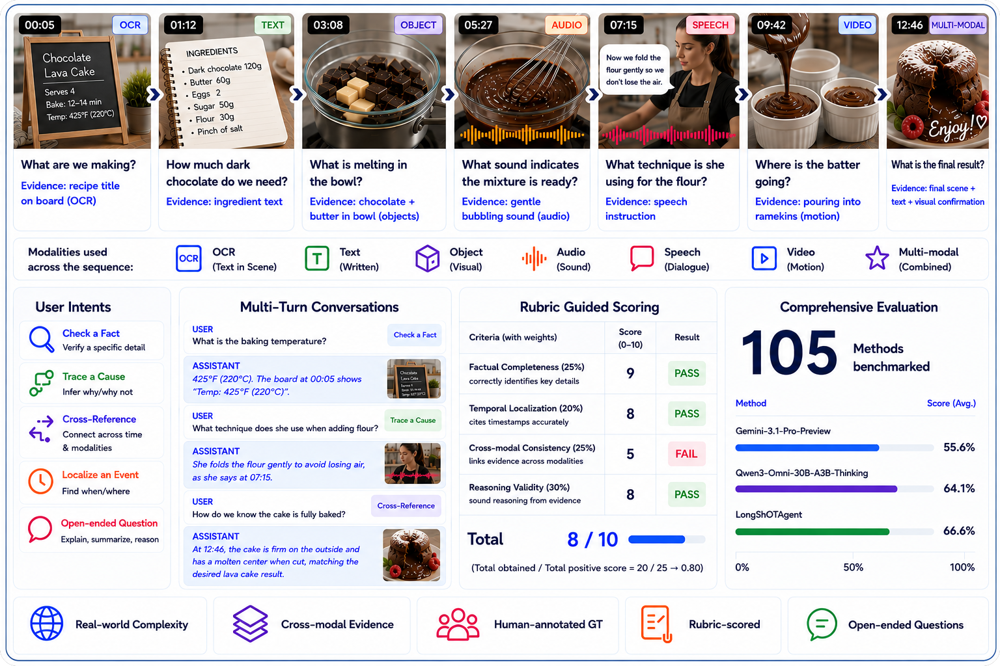
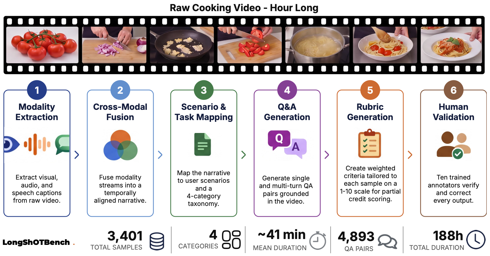
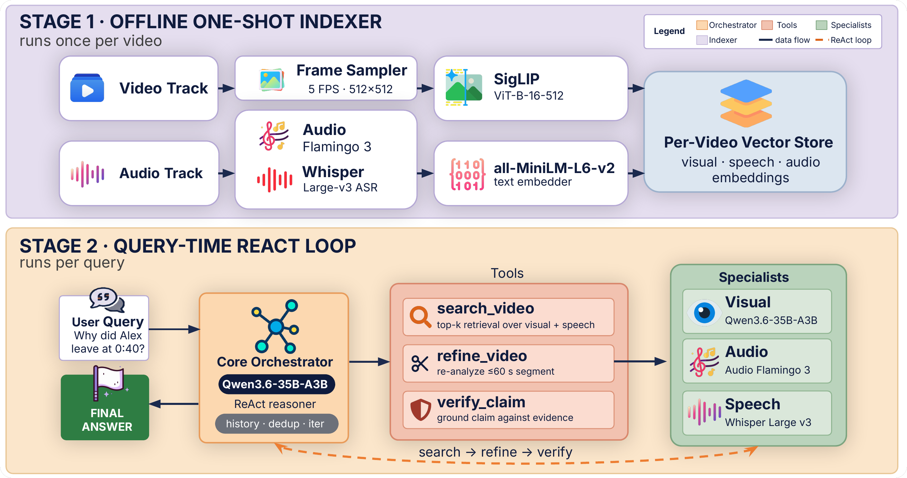

# LongShOT: A Benchmark for Omni-Modal Reasoning in Long Videos

<p align="center">
    
</p>

#### Mohammed Irfan K\*, Jaseel Muhammad Kaithakkodan\*, Jinxing Zhou, Sahal Shaji Mullappilly, Mohammad Almansoori, Noor Ahsan, Beknur Kalmakhanbet, Sambal Shikhar, Rishabh Lalla, Jean Lahoud, Mariette Awad, Fahad Shahbaz Khan, Salman Khan, Rao Muhammad Anwer, and Hisham Cholakkal

\**Equally contributing first authors*

#### **Mohamed Bin Zayed University of Artificial Intelligence (MBZUAI), UAE**
[](https://mbzuai-oryx.github.io/LongShOT/)
[](https://arxiv.org/abs/2512.16978)
[](https://huggingface.co/datasets/MBZUAI/longshot-bench)
[](https://longshot.cvmbzuai.com/leaderboard)
[](https://github.com/mbzuai-oryx/BiMediX/blob/main/LICENSE.txt)

## Table of Contents

- [Overview](#overview)
- [Installation](#installation)
- [Data Preprocessing](#data-preprocessing)
  - [Setup YouTube Cookie Authentication](#setup-youtube-cookie-authentication)
  - [Download Videos](#download-videos)
  - [Process Videos with Vision-Language Models (VLM)](#process-videos-with-vision-language-models-vlm)
  - [Process Videos with Language Models (LLM)](#process-videos-with-language-models-llm)
- [Dataset Generation](#dataset-generation)
- [Upload to Hugging Face](#upload-to-hugging-face)
- [Evaluation](#evaluation)
  - [Generate Model Responses](#generate-model-responses)
  - [Evaluate Responses](#evaluate-responses)
- [LongShOTAgent](#longshotagent)
- [Responsible Usage](#responsible-usage)
- [Acknowledgements](#acknowledgements)
- [Citation](#citation)

## Overview

LongShOT introduces a diagnostic benchmark for long-form omni-modal video understanding. **LongShOTBench** features 3,401 intent-driven single- and multi-turn questions over 274 long-form videos (~41 min avg, ~188 hours total), probing visual, speech, and ambient-audio reasoning. Each sample includes reference answers and weighted criterion-level rubrics for interpretable evaluation with partial credit. **LongShOTAgent** is a training-free agentic baseline that couples full-video preprocessing with targeted retrieval, segment refinement, and claim verification over visual, speech, and audio evidence. Comprehensive evaluation of 105+ models reveals significant performance gaps, with the strongest closed-source API (Gemini 3.1 Pro) reaching 55.63%, the best open-source model (Qwen3-Omni 30B) reaching 64.05%, and LongShOTAgent achieving 66.64%.

<p align="center">
    
</p>

_**Figure 1:** LongShOTBench at a glance. An illustrated hour-long surprise party video shows how understanding a single scene requires fusing visual cues, speech, and non-speech audio scattered across temporally distant moments. LongShOTBench captures this challenge through intent-driven single- and multi-turn Q&A paired with weighted criterion-level rubrics, scored against a human-annotated ground truth._

<p align="center">
    
</p>

_**Figure 2:** Construction pipeline of LongShOTBench. Starting from raw long-form videos, speech, visual, and audio cues are extracted and fused into segment-wise aligned omni-modal metadata. The distilled metadata drives scenario and task mapping, followed by single- and multi-turn Q&A generation and verifiable rubric construction. Human validators review and correct the Q&A pairs and tailored rubrics, ensuring a grounded and reliable benchmark._

## Installation

Create and activate a conda environment with Python 3.11:

```bash
conda create -n longshot python=3.11 -y
conda activate longshot
pip install -r requirements.txt
```

> **Note:** If you encounter CUDNN issues, install it separately for your version:
> ```bash
> conda install -c conda-forge cudnn=8
> ```

## Data Preprocessing

The preprocessing pipeline downloads videos from YouTube and processes them to extract video, audio, and speech metadata/transcriptions.

### Setup YouTube Cookie Authentication

To download videos from YouTube, you need to provide authentication cookies:

1. Install the [Get cookies.txt LOCALLY](https://chromewebstore.google.com/detail/get-cookiestxt-locally/cclelndahbckbenkjhflpdbgdldlbecc) Chrome extension
2. Navigate to YouTube and refresh the page
3. Click on the extension icon and copy the cookies
4. Paste the cookies into `preprocess/cookies.txt`

### Download Audio Flamingo Model

Navigate to the preprocess directory and download the Audio Flamingo model:

```bash
cd preprocess
hf download nvidia/audio-flamingo-3 --local-dir ./MODELS/audio-flamingo-3/
```

### Download Videos

Download videos from YouTube:

```bash
python download_youtube_videos.py
```

> **Note:** Some videos may fail to download through the script. Please manually download any missing videos and place them in the appropriate directory (preprocess/dataset/videos).

### Process Videos with Vision-Language Models (VLM)

Start the VLM server in a separate terminal:

```bash
./vllm_start.sh vlm
```

In another terminal, run the VLM processing stages:

```bash
python run.py vlm-stages
```

### Process Videos with Language Models (LLM)

Start the LLM server in a separate terminal:

```bash
./vllm_start.sh llm
```

In another terminal, run the LLM processing stages:

```bash
python run.py llm-stages
```

Once complete, the raw dataset with video, audio, and speech descriptions will be ready in the `preprocess/dataset/` directory.

## Dataset Generation

Generate the LongShOTBench dataset from the preprocessed videos:

```bash
cd ../datagen
python main.py
```

The final dataset will be saved at `datagen/results/final_dataset.jsonl`.

## Upload to Hugging Face

To share the dataset on Hugging Face Hub:

```python
from datasets import Dataset
dataset = Dataset.from_json("results/clean_dataset.jsonl")
dataset.push_to_hub("your-org/longshot-bench", config_name="postvalid")
```

## Evaluation

Evaluate model performance on the LongShOTBench dataset.

### Generate Model Responses

To generate responses from candidate models:

```bash
cd ../eval
bash generate.sh
```

### Evaluate Responses

To evaluate the generated responses:

```bash
bash eval.sh
```

Results will be saved in the `eval/results_postvalid/` directory.

## LongShOTAgent

LongShOTAgent is a training-free omni-modal evidence-seeking agent that serves as a reference baseline for LongShOTBench. It preprocesses a video into a searchable multimodal store and operates a ReAct-style search–refine–verify loop at query time. See `longshotagent/` for setup and usage instructions.

<p align="center">
    
</p>

_**Figure 3:** LongShOTAgent architecture. The indexer embeds video frames, speech transcripts and audio understanding into a per-video vector store. At query time, the orchestrator LLM analyzes multimodal evidence by issuing tool calls in a ReAct-style loop: `search_video` for semantic retrieval, `refine_video` for fine-grained segment-level re-analysis with specialists, and `verify_claim` for evidence grounding._

### Walkthrough

A short walkthrough of LongShOTAgent answering a query end-to-end — retrieving, refining, and verifying omni-modal evidence before producing a grounded answer.

<p align="center">
    <video src="https://github.com/user-attachments/assets/c6817e01-2ff2-44f1-a48a-cf174e4e41c2" poster="assets/longshot_agent_demo_poster.png" controls muted width="80%">
        <a href="https://github.com/user-attachments/assets/c6817e01-2ff2-44f1-a48a-cf174e4e41c2">▶ Watch the LongShOTAgent walkthrough</a>
    </video>
</p>

## Responsible Usage

LongShOTAgent can make mistakes. Please keep the following in mind:

- **Always validate responses against the source video.**
- **Do not use for high-stakes decisions.**
- **Research intent.** This benchmark, dataset, and agent are released for research and evaluation purposes. Respect the dataset license and the terms of any source content.

## Acknowledgements

This work is partially supported by the Meta Regional Research Grant, Project OMER, the Google Gift Research Award, and the NVIDIA Academic Grant.

## Citation

If you find this work useful, please cite our paper:

```bibtex
@misc{kurpath2026benchmarkomnimodalreasoninglong,
      title={A Benchmark for Omni-Modal Reasoning in Long Videos}, 
      author={Mohammed Irfan Kurpath and Jaseel Muhammad Kaithakkodan and Jinxing Zhou and Sahal Shaji Mullappilly and Mohammad Almansoori and Noor Ahsan and Beknur Kalmakhanbet and Sambal Shikhar and Rishabh Lalla and Jean Lahoud and Mariette Awad and Fahad Shahbaz Khan and Salman Khan and Rao Muhammad Anwer and Hisham Cholakkal},
      year={2026},
      eprint={2512.16978},
      archivePrefix={arXiv},
      primaryClass={cs.CV},
      url={https://arxiv.org/abs/2512.16978}, 
}
```
